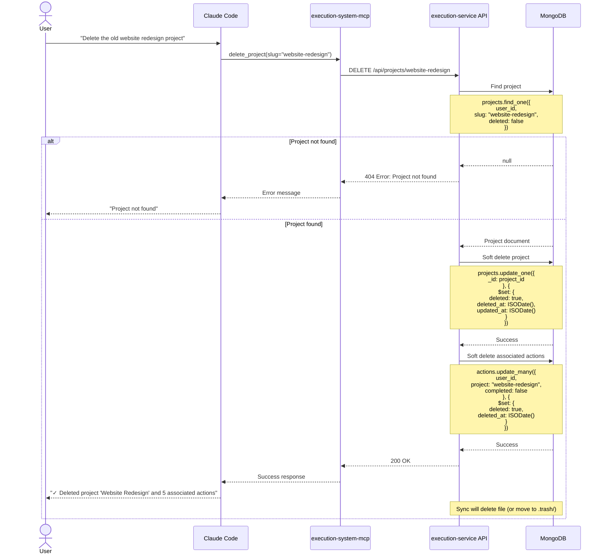

# Execution Service - Architecture

## Overview

The execution service is the backend for an AI-agent-first execution system that manages projects, actions, goals, and time tracking through natural conversation and APIs.

**Product Vision:** Users manage their execution system by talking to an AI agent (via MCP tools), using mobile apps, or eventually a custom GUI - all backed by this service.

---

## 1. High-Level System Architecture


---

## 2. Database Schema (Phase 1)


**Key Design Decisions:**

1. **Multi-tenancy:** Every collection has `user_id` - all queries filtered by user
2. **Soft delete:** `deleted` boolean flag preserves audit trail, allows recovery
3. **Denormalization:** `project_title` in `time_entries` for display without joins
4. **Sync metadata:** `sync` object tracks file sync state (file_path, timestamps, hash)
5. **Flexible content:** `content` field stores markdown for flexibility - fully editable
6. **Time stats:** Denormalized on projects for fast dashboard queries

---

## 3. Sequence Diagram: Starting a Timer


---

## 4. Sequence Diagram: Creating a Project


---

## 5. Sequence Diagram: Adding an Action


---

## 6. Sequence Diagram: Completing a Project


---

## 7. Sequence Diagram: Listing Projects with Filtering


---

## 8. Sequence Diagram: Editing a Project


---

## 9. Sequence Diagram: Deleting a Project (Soft Delete)



---

## 10. Sequence Diagram: Bidirectional Sync


---

## 11. API Endpoint Structure


**Authentication:**
- JWT tokens for MCP/API auth
- API keys for persistent auth (mobile apps)

**Common patterns:**
- All endpoints scoped to `user_id` from auth token
- Use slugs for human-readable URLs (projects, goals)
- Use UUIDs for actions, time entries
- Query parameters for filtering/pagination
- Soft delete pattern: `deleted` flag, all queries filter `deleted: false` by default

### PATCH Endpoint Details (Content Editing)

**PATCH /api/projects/:slug**
```json
{
  "content": "# Updated Project\n\n## New Context\nDetailed notes here...",
  "title": "Updated Title",  // Optional - regenerates slug if changed
  "area": "career",           // Optional
  "due": "2025-11-20",        // Optional - ISO date or null to remove
  "folder": "active"          // Optional - active | incubator | completed | descoped
}
```
- Partial updates supported (only send fields to change)
- `content` field stores full markdown body - completely editable
- Changing `title` regenerates slug (checks for conflicts)
- Returns 409 Conflict if new slug already exists
- Returns 404 if project not found or deleted

**PATCH /api/actions/:id**
```json
{
  "text": "Updated action text",
  "due": "2025-11-20",        // Optional - ISO date or null to remove
  "defer": "2025-11-15",      // Optional - ISO date or null to remove
  "context": "@phone",        // Optional - change context
  "project": "new-project"    // Optional - change project (validates existence)
}
```
- Partial updates supported
- `text` field is completely editable
- Changing `project` validates new project exists
- Returns 404 if project not found or action deleted

### DELETE Endpoint Details (Soft Delete)

**DELETE /api/projects/:slug**
- Sets `deleted: true`, `deleted_at: timestamp`
- Also soft deletes all associated incomplete actions
- Returns count of deleted actions
- Does NOT physically remove from database (audit trail preserved)
- Sync script deletes file (or moves to `.trash/`)

**DELETE /api/actions/:id**
- Sets `deleted: true`, `deleted_at: timestamp`
- Does NOT physically remove from database

**Recovering Deleted Items:**
```
POST /api/projects/:slug/restore
POST /api/actions/:id/restore
```
- Sets `deleted: false`, clears `deleted_at`
- Only available within 30 days (configurable)

---

## 12. Component Diagram


---

## 13. Use Case Diagram


---

## 14. Technology Stack

### Backend
- **Framework:** FastAPI (Python 3.11+)
- **Database:** MongoDB Atlas (cloud)
- **ODM:** Motor (async MongoDB client) + Pydantic
- **Auth:** python-jose (JWT), passlib (password hashing)
- **Testing:** pytest, pytest-asyncio, httpx
- **Deployment:** GCP Cloud Run (containerized)

### Sync Tool
- **File Parsing:** PyYAML, python-frontmatter
- **File Watching:** watchdog (optional)
- **Conflict Resolution:** Timestamp-based (last write wins)

### Development
- **Package Manager:** uv (fast Python package manager)
- **Type Checking:** Pydantic models + Python type hints
- **Code Quality:** ruff (linting), black (formatting)
- **TDD:** pytest with high coverage

---

## 15. Deployment Architecture


**Key Points:**
- API hosted on GCP Cloud Run (auto-scaling, serverless)
- MongoDB Atlas (managed, multi-region)
- Sync script runs locally on user's machine (access to files)
- Mobile apps call API directly
- MCP servers call API from local Claude Code

---

## 16. Summary: All Supported Operations

**Project Operations (10k):**
- create_project, list_projects, complete_project, activate_project
- **edit_project** (update content, title, metadata), **delete_project** (soft delete)
- move_to_incubator, descope_project, update_due_date, update_area, update_type
- search_projects, audit_projects, list_needing_review

**Action Operations (00k):**
- add_action, add_to_waiting, add_to_deferred, add_to_incubating
- complete_action, **edit_action** (update text, metadata), **delete_action** (soft delete)
- list_actions, search_actions
- audit_actions, list_needing_review

**Time Tracking:**
- start_timer, stop_timer, get_current_timer
- add_entry, list_entries, update_entry
- get_weekly_summary, get_daily_breakdown

**Goal Operations (30k):**
- create_goal, list_goals, update_goal

**System Operations:**
- list_areas, update_review_dates
- sync_status, trigger_sync

All operations are:
- Multi-tenant (user_id scoped)
- Authenticated (JWT/API key)
- Validated (input checking, business rules)
- Synced (bidirectional file ↔ database)

---

## 17. Removed: Data Flow Creating a Project

*This diagram was replaced by Sequence Diagram #4 which covers the same flow in more detail.*

---


---

## Phase 1 Scope (This Week)

**Build:**
1. FastAPI app structure
2. MongoDB connection + collections
3. User auth (JWT + API keys)
4. Projects CRUD API
5. Actions CRUD API
6. Time tracking API (start/stop timer, entries, summary)
7. Basic sync script (one-way: files → MongoDB)

**Testing:**
- Unit tests for services
- Integration tests for API endpoints
- Test with your personal data

**Deploy:**
- Local development first
- Deploy to GCP Cloud Run once working

---

*Last Updated: 2025-11-09*
